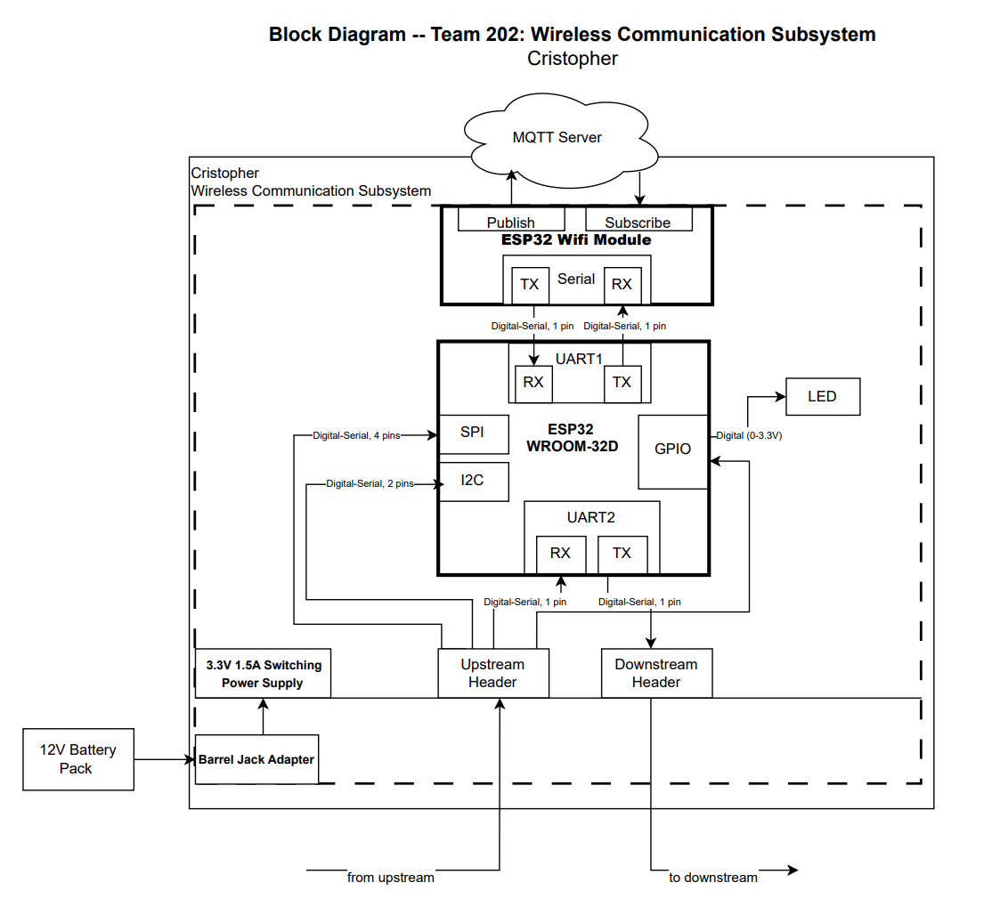

## Overview

The block diagram presents a low-level view of the rover’s electrical architecture, illustrating how the power source, voltage regulation, sensors, actuators, and communication hardware are interconnected. A 12 V battery or external supply enters the system through a barrel jack and is regulated down to a 3.3 V rail, which powers the ESP32 communication controller and associated peripheral circuitry. Sensor subsystems provide data inputs to the communication controller, while actuator subsystems receive control commands for mechanical operation. The diagram also defines how different project teams interface with the system by establishing clear electrical and functional boundaries between power distribution, sensing, actuation, and communication components.

## Block Diagram: Wireless Communication Subsystem

