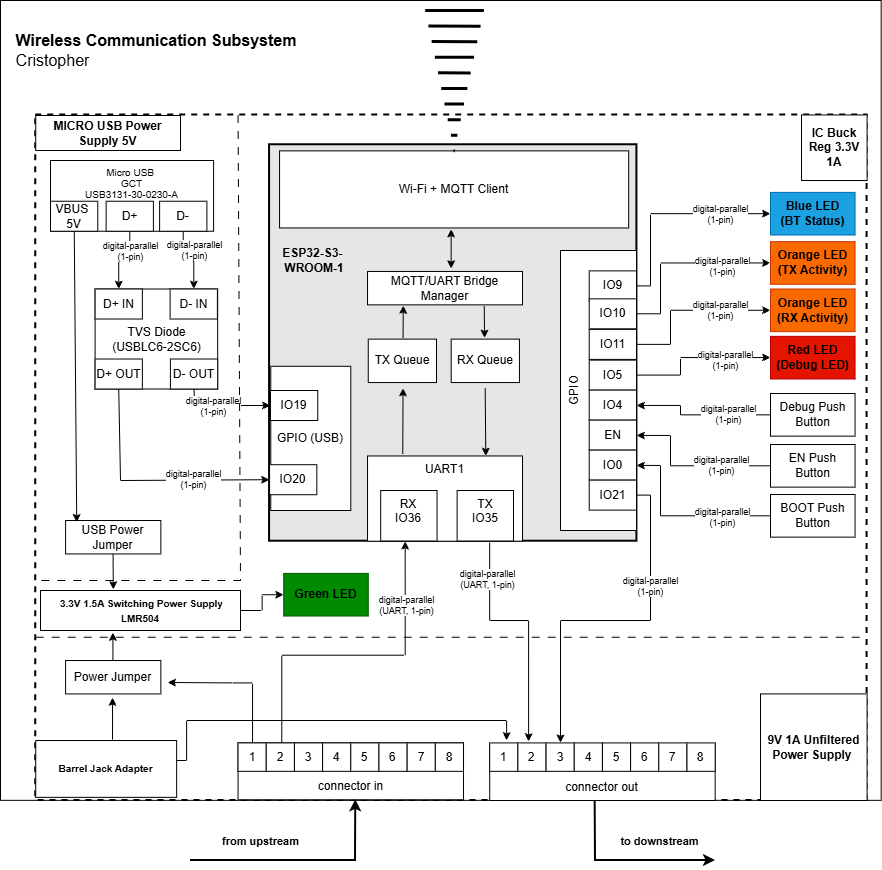

## Overview

The block diagram illustrates the electrical architecture of the Wireless Communication Subsystem and its integration within the rover system.

The ESP32 on this subsystem functions as a communication gateway rather than a primary system controller. It establishes a WiFi-based MQTT connection to enable bidirectional wireless communication between the Human-Machine Interface (HMI) and the rover through a centralized broker.

On the controller side, data from the HMI is received via UART and forwarded to the MQTT broker. On the rover side, subsystem data from motion, arm, and other modules is aggregated and transmitted via a UART daisy-chain to the rover’s local ESP32. The Wireless Communication Subsystem interfaces with this ESP32 through a dedicated UART connection, forwarding command and telemetry data between the UART link and the MQTT communication link.

## Block Diagram: Wireless Communication Subsystem

> Block Diagram: view as a PNG [here](WCS_BD_Final_Final.png), PDF [here](WCS_BD_Final_Final.pdf), or via URL [here](https://viewer.diagrams.net/?tags=%7B%7D&lightbox=1&highlight=0000ff&edit=_blank&layers=1&nav=1&title=Wireless%20Communication%20Subsystem.drawio&dark=auto#R%3Cmxfile%3E%3Cdiagram%20name%3D%22Page-1%22%20id%3D%22uU3jruizu6RyzjFAHRRA%22%3E7V1Zc9s4tv41rup%2BEAr78mg5SXfmJuOMnXT33JdbtEXbmsiiR5Jju3%2F9BUiCC0hJJMVFiuRUt0SQBCHiOysOzjkjF4%2Bvvy28p4fPwcSfnWE4eT0j784wHknJ9YdpeYtaFKZRw%2F1iOomaUNpwPf3bjxth3Po8nfjL3IWrIJitpk%2F5xttgPvdvV7k2b7EIXvKX3QWz%2FFOfvHu%2F0HB9682KrX9OJ6uHqFUymLb%2F7k%2FvH%2ByTEYzPPHr24rhh%2BeBNgpdME3l%2FRi4WQbCKvj2%2BXvgz8%2FLse4nu%2B7DmbDKwhT9fVbnhx3h%2BeXlxoa5%2FfHpFr1N%2BzSb%2FOyrpJW5art7sO1gEz%2FOJb7qBZ2T88jBd%2BddP3q05%2B6JnXbc9rB5n%2Bgjpr3fT2ewimAULfTwP5vqi8Q9%2FsZrqV3o%2Bm97PdfMqMPc8Bj%2B8m%2FARpteFv5z%2BnT0OVt4qc6xx5WeP%2Fck0ezgLbr%2BHIzRDiLGQOe3FT575d%2FpXjqNf%2BMObPce%2FMG7Q4%2FRfM28hfpG%2F%2BcGjv1q86UseMnMtlAIyRvNLBhsSAi6j5rgzzC0I3iy642Mvhud98oh0BvWXeBJrTChufUIn3vIhebX3C28y1T07M1wy6X1O73K1CL4n9ImTFjukiX%2FnPc9WGSDc6t%2FgL0qw%2BTidTGbhTwrmqw%2Fe43Rmpux3f%2FbDN9fFJ2I%2BhXB8XHxQOxDjkgEmihAjCBDuQIwxgEkOZRhRQAlM%2F3hHoCOtg279tGSQdobJe27%2BDQK34pwXYViA216giigOKCuginABCMujSkoFLGwsqigFuAUkvczJfyj6azL7%2FeXq%2F%2F4nuPr249%2F%2FHcn4%2Bf6kIJaL2AqeF7f%2BBljSAgZNt9fxYbBYPQT3wdybvU9bx3mUptd8CozQCgHxH3%2B1eovnynteBXnk9gnEWB%2FyFvf%2BasNLtSqXg5siSBb%2BzFtNf%2BTffOvcgrbOLfaB%2BHuTLFkOuI73oHJewaMOdLfmZVtdm%2F%2F32eigY5R%2B1d%2Fu48%2FwlptMg%2Fdo3v78Zmk%2BCCB%2F6L4QYOf64%2Fplurp9mM7v9fcvwYt%2BDbrt%2BelJ%2F9K4Iw2YG7dz3RYNKd88mf5wm3YZ%2BafPVwzSBuPQzbmhNGC4FBaYLbYaYCK%2FeV5F5KorFZGd6O9g6W%2BsbdrQwv6Hd%2Ftdf5xPvCfzc%2BvAugGAGQeSSAEVF4IiZXXPDJ4RhUDBzL8S7RQLhLFSlDNHUZVEAaUYZAIhShCkHSFfdmrtpmAY3uCtTCU7EsPMu%2FFnY43F%2B%2FC1VdBYv51ffUUbeHwL7FYbTZhJyClDHGEFiwYUYo6eq6QAkEBBjKlOLCpieDINXsoRkhxp7HJJOoKn6hSee%2BOMKUDi6q8SPHy8NFymNUwwCAQq4EDzNSJySDDmMkAqP%2F%2BdiWIEW5%2FySpZzSp%2FDuWnQXrOpP6ejD9Mz47bT5%2BDnf339qj8uZsb31Qh%2FQvMXVTS5qQLIsbhV0eLW4CVcpX9doRHVML4zRvV8cm487SmPycAxj90%2B0ZbzW5qDL95Kg8nASusBUJaraNv5SHRTqamc5SwbWEb8hC%2FBNFQEq%2BlIghgdjENMJeOYOg6YyBcS95hdBHAeQqjkQPMzwRRhUoOtxjMiP0PhGSHUkre1A%2FpwM%2FR179KpxHxQc%2Bbj0oH%2FOl39Zb4DFh%2F9O3Pm3Wv24K2csloX2Ds4i8JbNYfw3jIXPBkYLTdQg4IIEAwFZFJiwrDIWwyUA0QRZRq0jMPYYliH%2Bi2dCUaBIELASp0RTR5AMV69C%2F0l%2BvlrRmdYviRYCsSZ0D0VfqlRPgWESDDSlO7NoAUkXCptbDFhPcfW2aCtNwGl0twh1HAdA6w9yi93%2BsacLo%2B8s2TlNMsANrIOhy18MoSXJ%2BXqXgKXKGPA6s7Z%2BIy964HkSp0Hyydvnvul1mVwG7EV44Zb3N94v%2Bh3p2cDOh%2B%2Fhn1Dw6hGdzFLM7c8BvNgGemUyfnIQWHOwqfXqF1rPKtR%2FA7Pw2F4i0h9gjcJgxvlh%2FKLoTbzcKyiTxKPoujsYG4gAdMoMq3hKnlyZFHFQlzplnfmu0ELMy%2BKaXxuuxYl11p0NeoGp91k57Ckr8JjMiOIJjM5k0JXN0XgNedQeBi9fHMcQ9g05kFsTsYwNidTIJsTMGyz3Dd6JDOvnr0Lz6SjisCXjMr8z0DQXBSBsDDyaELNBSl%2B9NF5eKnSGLIPSC8Mj%2B6j75PpvSaR2Ui%2FKW82C39%2B8sRwOuxj7Q3ZC0L7sO0R%2FWKcFabhIrwBjZ6m818Lw4ofnR1V%2FAYjE6E45QmoUnHKDKtOriQIcoARRtwoZVJIkfb6ll7GhTYfoKRSmOdLJtOrvGV62X3mKS6ww8ME3dnGPM3F1xWIMzHQo8nJ%2B3JOzOrErE7M6sSs9pxZVXTnlBo88S3aVMMir1Pjyg4Ae0lwd7f0u9Gw6UFq2Bn7Wg2rcEdQKRL9RvGX8VnHxGkkiiXMnVzbm7HIkQ1AjLE42maedwTGciyRk6Mnhuhcv8nI00OkPTa%2BnhEEkCYtqccnPHrLHn3xF1M9IYbSevED5cONyqMB17hRu3UYaSlUcJwLNyS6cA%2BVW%2B7Z4rsJn2q0xNixpPJOW04xgAIKRJQRjsjxq1T23iDKgSIEynh13XGGYQYopUQ%2FBjHjve3Xe4N3lS3kJFsORbZoxsQVZHnhsmE9vH%2FhUim6yZiGeWiVrarmVyfXh7rXgGVOQoUQjAeFzoprmYMuym8I0Vhr1peb1auFN1%2Fa%2BRiHnCI5NzMra6OJt%2Fj%2Bi7G%2BCw6A8DO0y03ERmiYZ778Wm6bv7%2F%2BQvDomozcaMUtNOXSy5YXELX9eXV5%2BXmEanbdYAVZixKiJMLFwG0ptPWhKEKCUwGZE3olFQRYcCug8qsLhGihKbVgUSJct2DrSXm3pWXeTOdLl5ZvZ95yOb0NydJbrIrNaxed0%2BU0TM4y62kAQntcvqZmDlz9yvidTIBrQYGjKqfBIa1XqBYUuL6Jfrj1b6IVJcApJxbLeSWHcAmQksqu%2BDlIrb4QtvkpWALGyLqndL0ELtqjkvXkkGKW5RC7Ba1HDEyMAWYk5bE5yGi4aO1bo0Wa5VVEcFNg6qcwRi0b53lGTQ2TR4pYRi16Ds6Qe4zMFuIljgzNG3BGNM5EGsjQPN4AA81cI41EWhvRPgRSoCSjxGykpkzSzizWcjCrPsCcgFJkUYk2axwZfcLMYN4jBLcSwkmhyPtmCBAEUxv2wx0QMsAkTzgqaoh0pMEMJS7Xr0NywpoMzBBQgZw6Brp1wew10AUnWaAfEM63ekLlvtEDBVzSRJHJ%2BypDDUMb3QxyzbT1RTvQw%2FqnMCT1WY6MF5MKaTe390UQ7ee7qBlvvy7ifYhsGG1F19fY%2B1biTLlZNPbDbLs1%2Ful6uBoX87MmXpftO9%2Bw8b6z9J%2B7g55psnJEj6RYy3dtNGBOpSYYsZ6Ud0sGgluH%2BwGhuqsNoBXgjhphDUtgIMZojDhZxJoESGb%2FiT0CW%2FtZQE5gqwI2PBTYJDMx78npYVDXfjaJE%2BqqoI4MhDqFCFBIcRL%2FY8PArv0kCifYVYEdHQp2GlgIolTNGwZ2%2FAS7QWDHhoKdgABLgkX8byDVTpxgNwjs%2BFCwU7oLzmwuFzQM6vpK13JCXR51YhjUEYi5WZp3Ugj1jbpus7CcULcOdXIo1DEKJJZWwrr7zPtBHRk8EcxewvEYHNPBc7OMMrt6preErktKAOI9IL%2FbFOR7DvDj81FvhV1PDPe0NHJU3mqCiADE7D4VEDJCxUCwOy2SHJW7miDOAOOcK4ZMfp9h%2FDfktEhyVN5qou8GgkqGSJjxyc0o1RPqTmskR%2BWsJvoxQBFICGIMSugmee4Ldqc1kqNyVhOTHhUhjKiK0zcPA7vTGslxeauxkEBbr4oLhSglciDYnRZJjstdTSAHVDAhub4ds4Hc1e0vkqQ4Qg6OkIMj5OAI5XGEsjiCBRzVSjvebw2RMEmFv3j%2Fw49yVZjBrym4VwGgUc7yD1FyCDheTM0mEAw%2Fe3Pv3qRia4BeQgBRWDM9U6aDKGn3juUqK1CgFE4y7SqnTF1UaIHYzTL5lWUiIFBMmv0B2mKmvLMKVO2vtuxlcY%2B9K4Hz9S99%2FK9n3%2BTqa4A%2FSgAlgmKoDPdLNnRl4Me1TGYoAR8lRfQJdx8YkYBj452BVFsvtCueSdtf6DiBrgroroYFXZRxQCuJdi%2FsMOhr3%2FF8EOiLytv0BL2HYDH9W%2FfgzeJhF7BYsmb825ePly2micGyWGxO5IUwQfYaK3c3bSbcDXbdep73t6bR1zU1jVjLNY1wYbLLahoJrplMbsq7q2lED7u%2B4K2h3%2Bk8TfhTqdhvvex0nbCjAgRtBc5%2FPD8%2BNVf4aVHHVwxgJ2DUFKp2AvYE7wxh7Xt4TwhrgrBv1yad28A447gznNVJx7StGDUrALRucpxJPG%2B8FBuZJDg0m4fBJA5BtqF6nrOjzRqCBcFuTliJG2YbK%2BtMqH5zHtB%2BUjdtQWcm0zHHtiFOlEcPJFHe1nwfVeus94hkml%2F7LwjlWkh2OyM9I7mPvE3HwvhqF2ST0JRcy%2FNFvjm%2Fduk9W3Ny4233bKunJtTakTZIZ1MyHOp01jHuWR9pnE64X4dhURTh0iyzweQPbaECVq%2BHrfUCiyOKFv7c%2FhpwebM8Uxhqv2jfuQpt2%2FoKzeorRp%2FGScayk8LStsLirM5wlpqGjXQWtz8JC%2F11DWjcCNDLB%2B%2FJfH18vTd1jIBn0L3E4MX0E0L9XVjhGOdxfqOhnXOce4uVRTZWgOT%2BIvD7T9YjwEoIpTwnK9xCAXmSIvsJf1t%2BvRb%2BEaxIAMmFtXJgU5f%2FItRUdWGiWEpcAoFSMQHderJdk8KRrkINvgYaLTLBX75dj389a%2BKhQ5SCEozbhaRcsQFnhZMzILoqWc%2F6ijH%2FSRzENZZD4VoUljDNzFJXSV2Qmf4xI4smU%2FYj5GnsrLyw5tpdtWY0tu3z9HYR6J5CF%2FTaKh%2FZO2pv4s3e%2FNvF1y661aMniKARgSOtVMLReaOHtLCUKCAQJcFcnCTe9sQDL%2FJrx7izZR5byOQkLHoWFu%2F%2FqY%2B%2FPC8f9Mf4ebUKmqVO1SYpxwoSbQpIyCkjRYBJCtiGHepEKqAyf%2FmkW0yLJNfQbQ18vFKIYLGOVPs1o8ogXVJHKoYDH0TTriEL3KrMM%2F8u4lpuHWfE40LO6yTETWn%2FZb0UuvhzqpV3f7nUF1wEj4%2FPc%2F3mV1ODc3j9fLN80zbRY4a73tRg9p385IvFdKlF94NZXk0zTDT99W3KDQWKSiFWjlbICQRO3JvWAEALSmFpRcK%2BMkr8JDphW%2FKmwAq%2B%2FnGtG95Ng4lfVrbwUMrJaSXt0wUf4esLni2t2FGZt8RrkNXDTMkWJxJCIArytj2RErhZ%2B9ujqToF3DKxEKWd0QI19lDcd1j%2FU%2FlLrep%2Fqlw6d6c5tmGiVSq5bgTJ8VRyXVe1Ncvn%2BijKSqHr1B603nz7Ub%2BD6rT6v2bMnBR5ORWFoDaBGXDKcBGYGuTt8%2FKGcW2lnZWT%2FBHyclSAzaC8XOzKy8WJlw%2FEy6WTwmC0QakrX%2FpB%2BQ4ckHXH9w87MLvI90ddcn1jO%2BP%2BuH77%2BSkGnZs%2FtF22zvOfIUr2R4u2WbWJdT3knc5qneDebaK8hOM3rd%2BKtPjIF%2FVj%2FOwniZnhBSxuR06HQTNcEcBJ3jVOZBFylaNmyjqkEAHKIBcSIckZ7a788EZD%2BWdhXpFBAT%2F%2Bs0v50rOD6LC3t5fK%2Fo4nSCpgU1z0MkP4J5uhiIguv33tlYoo63KODjtAqpyKOp4hs0jc4wy1n3Br0Bn6eGnLoXcyO1LllWHaxr7z8ok57HCRkomxvppuJkYWgkMZT2P8Wp8eHBNkK5aKZZMtmCp5MyWJcV5npKS7bM%2Bq1jrfR2floJXJ62%2FBcTZgMcgcPG7eL4MIYISlQc%2F5zkhRWlS2lbZ0zRTQ5JhaTfmndGw02djcxi5gS7LH4wLOhyREnqJ1buE1IQB9e4uxZHlTfQMDXwPiTbd35yu26aHbEQglUD0JhBoCQZXQwv4KBEHzWiWT9TYIa5aPHQ%2FXbmJAlo%2BnL1Zv91c0Z%2FUlCtWJ1e8Tq4cAYeZ4XSvw9rxlPOqPux92CEg%2BvPLMrOEwAWEt%2FDcKp8xEMIZPNX9hgGL83YQoZqNR3evlub2eojGl6NezspjQcATxNJTFLRSTFC583wRpfnr%2FrsX1tJ13CJibAYbpDgFns6%2FAQGV2O3Zm2x72uncJ2Pn78w%2F7B3Z9At14yMftgHpsTm7EdJHPj00y7Wv99p%2BXu3L7lvfKOI42rBCQWfB3tQLdQXHwA68pUITmzOhR4yScfcP2IA3xO4%2FLUNTUJZUCHV8I45poQhqXC29%2BX5s4wvTe57dahZmu3vabPLR4BIhlyIN0RR6HvV6wHlP7JxsSwtkmG7YRZHcUcnVAFCIlsBnXWqeKDupdD0oV4zD30v5RRf56nyFqd0PpwwmBEzhpyUK40q%2BrJjG882%2Be76Ob9psUKGFAbrC9dyOFww6cOdxt7hZ%2Be7HTvbBMTlrZ216OOHxC3CCIG19eft1TwDFlkil07yqplY1426oPKfdad7z5qOlS0R4u%2B%2BCqscyVNy01Ws8h2A2Zj6Xt2tRmhRviiJDSBaDWdrfE2G28ymLBfzyrLHuxpwoCLGQ%2B0NZdCKmwkkI3dtDdSgr5yUJCP152GG9IMJRA5KNwTFVB%2FV%2F615UmXys%2F%2BVbZNkiShJ9JtokC9IaRbU5sAM2Lqu03EN6HbNs1gsCC%2FyTb%2BpZt0l3kx3VlG8pXEe5PtB12kECJaEsyuvQl25QEJJP3HbL1c7%2BTbKtVg2CrbCsphnSSbXVkW9X47a5lm%2Bu2irPQrJdt7g1oQ%2BBea9FxuwZCW%2FCfZFvfso3nA3rqm21OhoUezbbDLoNZJttQ5VltRbZRLPuJYKlVcWSrbDslRMov8Q4towh0RI7IbR6qcEOcerFbGYV3lVElJXFOMqoHGUUUdGRMdfurBzF02KGpJWKI9SyFmAKc9GFhtbkfipRzgyOUQlU3NvUshRjaYikVbti057U1KUR2lUJHt49oL6RQmAGWOVkDq9tKPYihny45A608ce2IIdmXGGLNxNDGEi49O%2FrsntyzdEduuj%2F3YPbk0j0xoFyfHeNbDKjCDaQP0UV3FV3lTumT6OpBdBFnBWufRBctAdAhi673Hea0K5NcDBnJ1ZW0arMshY2LPUmrJtKq9fzn7YRbcLRNWrm5G3gf0ortKq1OpTaGklZCNk2404OwOuzNJIVJ%2F3jZc0AFo11KqzYLb9BhpFXDeuBWylmJt%2F9SrtSgtcG4g0s5J%2F6dqW1SzrlBYLj5BiR3vEHGAO1Ujtqw7uZy9OjKnBxa4qPQQJQ4h639MhDxzyZz7fB7E7qiS6FbZ8dZ0%2FSB6YQhZ8KQM2HImTCUnzCUnTBYmDBzOr%2FREJfT%2BP7m7lMirz4rXit3n0Sw9Pb6Sfv0QBJwWpmlFMDO9pCOU%2FdZF3lzCdbxpjJUKsEcwLcK8M25B%2B4WwaNueX7SdOB7j23JGEZtm5UxG1ZY1sQa5kscj7DTQ4d1t%2BpEZ594XNc8jmC0C4%2FTt1PgRL4q2JDNEULKx9IXg%2BO7quh2vD8PgyvBclLSPtKctdmN4SR4mVsmV1aLvgXGp3Vr7mC1Pt8bDcf38K58L874VIHpda%2BJT7zlQ3LaHHzxVhrHBrj6DUM5MBcs0cWYAIynOSPyODBcjBKsKEKCU4GQo1hVz67MHZd%2Bz9mVeZ3IvBPKWi9wxyGQcjMCDgdLlbY8bnEPeMsnPaf64G76aqZyWH9BQXipP%2FQF6Fz%2F79v8bjrT4Apzg30JXrRQxvD6%2Belp9raudmcjEZdFIoIcWKMqA7xsc6IauT5ORQDd4FrayQ%2FBK20IOuyZ%2F2gyy42fb7%2FrjyvfJNcigFg0tDS%2FnAHrtM1Mb6bVzq426IATmh%2BJpK4m%2BLAT4W6f3c8fL64uDVVfj0vIGeZK7e42x9ZkydIvpUC4lXYZA5g4M1w%2FMFIfLoJglWX0eiYePgcTY2C8%2F38%3D%3C%2Fdiagram%3E%3C%2Fmxfile%3E)
