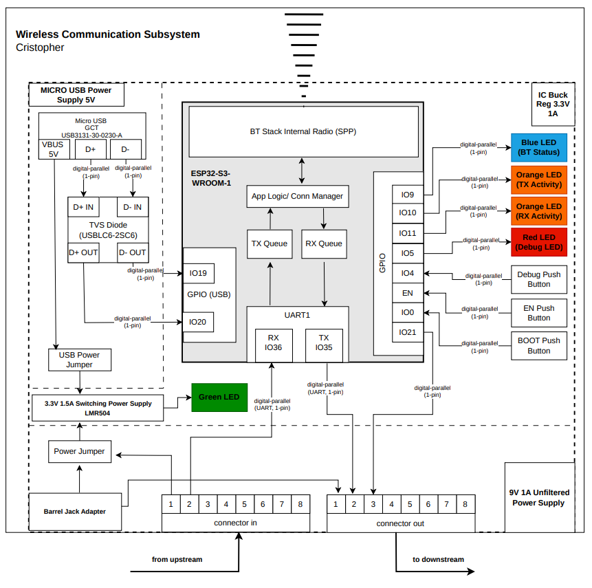

## Overview

The block diagram illustrates the electrical architecture of the Wireless Communication Subsystem and its integration within the rover system.

The ESP32 on this subsystem functions as a communication gateway rather than a primary system controller. It establishes a Bluetooth Classic connection using the Serial Port Profile (SPP) to enable bidirectional wireless communication between the Human-Machine Interface (HMI) and the rover.

On the rover side, subsystem data from motion, arm, and other modules is aggregated and transmitted via a UART daisy-chain to the rover’s local ESP32. The Wireless Communication Subsystem interfaces with this ESP32 through a dedicated UART connection, forwarding command and telemetry data between the UART link and the Bluetooth connection.

## Block Diagram: Wireless Communication Subsystem

> Block Diagram: view as a PNG [here](WCS_FINAL.png), PDF [here](WCS_FINAL.drawio.pdf) via URL [here](https://viewer.diagrams.net/?tags=%7B%7D&lightbox=1&highlight=0000ff&edit=_blank&layers=1&nav=1&title=Wireless%20Communication%20Subsystem.drawio&dark=auto#R%3Cmxfile%3E%3Cdiagram%20name%3D%22Page-1%22%20id%3D%22uU3jruizu6RyzjFAHRRA%22%3E7V1Zc9s4tv41rkoehMK%2BPFpOujtzk7HHTtI99%2BUWbdG2JrLokeTY7l9%2FAZLgAlISSXGRYjnVLREkQYj4zoqDc07I2cPL7wvv8f5LMPFnJxhOXk7IhxOMR1Jy%2FWFaXqMWhWnUcLeYTqImlDZcTf%2F240YYtz5NJ%2F4yd%2BEqCGar6WO%2B8SaYz%2F2bVa7NWyyC5%2Fxlt8Es%2F9RH784vNFzdeLNi65%2FTyeo%2BapUMpu1%2F%2BNO7e%2FtkBOMzD569OG5Y3nuT4DnTRD6ekLNFEKyibw8vZ%2F7MvDz7XqL7fltzNhnYwp%2Bvqtzwczw%2FPz87U1c%2FP7%2Bglym%2FYpP%2FHZX0EjctV6%2F2HSyCp%2FnEN93AEzJ%2Bvp%2Bu%2FKtH78acfdazrtvuVw8zfYT019vpbHYWzIKFPp4Hc33R%2BKe%2FWE31Kz2dTe%2FmunkVmHsegp%2FedfgI0%2BvCX07%2Fzh4HK2%2BVOda48rPH%2FmSaPZwFNz%2FCEZohxFjInPbiJ8%2F8W%2F0rx9Ev%2FOnNnuJfGDfocfovmbcQv8jf%2FeDBXy1e9SX3mbkWSgEZo%2Fk5gw0JAZdRc9wZ5hYErxbd8bEXw%2FMueUQ6g%2FpLPIk1JhS3PqETb3mfvNq7hTeZ6p6dGS6Z9D6nd7laBD8S%2BsRJix3SxL%2F1nmarDBBu9G%2FwFyXYfJhOJrPwJwXz1W%2Few3RmpuwPf%2FbTN9fFJ2I%2BhXB8XHxQOxDjkgEmihAjCBDuQIwxgEkOZRhRQAlM%2F3hHoCOtg279tGSQdoLJR27%2BDQK34pwXYViA216giigOKCuginABCMujSkoFLGwsqigFuAUkPc%2FJfyj6azL74%2Fny%2F%2F4nuPz289%2F%2FHcn4%2Bf6kIJaL2AqeFjf%2BBljSAgZNt1fxYbBY3Qd3wdybfUxbx3mUptd8DozQCgHxH3%2B1eo3nyntaBXnk9gnEWB%2FyFnf%2BasNLtSqXg5siSBb%2BzFtNf%2BbffOvcgrbOLfaB%2BHuTLFkOuI73oHJewaMOdLfmZVtdm%2F%2F3yeigY5R%2B1d%2Fu4s%2FwlutMg%2Fdg3v78emk%2BCCDfdV8IsFP9cfU8Xd3cT%2Bd3%2BvtF8Kxfg257enzUvzTuSAPm2u1ct0VDyjdPpj%2Fdpl1G%2FvnLJYO0wTh0c24oDRguhQVmi60GmMhvnlcRuepKRWRH%2BjtY%2Bhtrmza0sP%2Fh3fzQH6cT79H83DqwbgBgxoEkUkDFhaBIWd0zg2dEIVAw869EO8UCYawU5cxRVCVRQCkGmUCIEgRpR8iXnVq7KRiGN3grU8mOxDDzrv3ZWGPxLnxtFTTWb6eXX9EGHt8Cu9VGE2YScsoQR1jBogGFmKPnKikAJFAQY6oTi4oYnkyDl3KEJEcau1ySjuCpOoXn3jhjCpC4%2FKsED5%2FODZdpDRMMAoEKONB8jYgcEoy5DJDKz39nohjB1qe8kuWc0udwbhq012xq%2FNXorqtIyn4yo9BGoP566U2mgf58d3Vx8b4REoXmNKpofFMFkGN7q6LtrWFMuEr%2FusIlqmGGZ8zr%2BeTU%2BNxTbpMBZh7FfeIu58E0BxfeykyobtEaAZTlytp2jhLdVGo0Z3nMBuYRP%2BEimIYqYTVtSRCjjXGIqWQcU8cVE3lF4h6zywHOQwiVHGjOJpgiTGqw1XhG5HEoPCOEWvK2dkAfboa%2B7p07ldgQas6GXDrwX6arv8x3wOKjf2fOfHjJHryWU1bronsHt1F4q%2BYQ3mvmgkcDo%2BUGalAQAYKhgExKTBgWeduBcoAookyDlnEY2w7rUL%2BlM8EoEEQIWKkzoskDKMard6G%2FRD9%2FzegMy5cES4E4E7qnwi81aqiAEAlGmtK9GbSAhEulzS4mrA%2FZuh20HSegVJo7hLquY4q1R%2Fnl7t%2BY0%2BWRd5KsoWYZwEbW4bCFz4bw8qRc3V%2FgEmUMWN05G5%2BwDz2QXKkbYfnozXO%2F1DoPbiK2Yhxyi7tr751%2Bd3o2oPPxPuwbGkY1uo1ZmrnlIZgHy0i7TM5HrgpzFj6%2BRO1a41mN4nd4Gg7DW0SKFLxOGNwoP5R3htrMw7GKPkk8iqLbg7khBUyjyLSG6%2BXJkUUVC3GlWz6Y7wYtzLwopvG57VqUXGvR1agbnHaTncOSvgqPyYwgmszkTApd3RSB15xD4WH08s1xDGHTmAexORnD2JxMgWxOwLDNct%2Fokcy8evYhPJOOKgJfMirzPwNBc1EEwsLIowk1F6T40Uen4aVKY8g%2BIL0wPLqLvk%2Bmd5pEZiP9przZLPz5yRPD6bCPtTdkLwgtxbZH9M64LUzDWXgDGj1O5%2B8Lw4ofnR1V%2FAYjE6E45QmoUnHKDKtOriQIcoARRtwoZVJIkfb6ml7GhTYfoKRSmOdLJtOrvGV62V3mKS6ww8ME3dnGPM3F1xWIMzHVo8nJe3WOzOrIrI7M6sis9pxZVXTnlBo88S3aVMMir1Pjyg4Ae0lwe7v0u9Gw6UFq2Bn7Wg2rcEdQKRL9RvGX8V7HxGkkiiXMnZzcm7HIkQ1FjLE42maedwTGciyRo6Mnhuhcv8nI00OkPTa%2BnhEEkCYtqccnPHrNHl34i6meEENpvfiB8oFH5XGBa9yo3TqMtBQqOM6FGxxduIfKLfds8d2ETzVaYuxYUnmnLacYQAEFIsoIR%2BT4VSp7bxDlQBECZbzO7jjDMAOUUqIfg5jx3vbrvcG7yhZylC2HIls0Y%2BIKsrxw2bAy3r9wqRTnZEzDPLTK1lfz65Trg95rwDInoUIIxoNCJ8VVzUGX5zcEa6w168vN6tXCmy%2FtfIxDTpGcm5mVtdHEW%2Fx4Z6zvggMg%2FAztchO7ERrmmS%2Fvy23zj1cXBI%2BuyMiNW9xCUy69bHkBUdufl%2BfnX0aoZtcNVpC1KCFKIlwM4ZZCWx%2BKIiQ4FZA5QVhSQYAFtwIqv7pAiBaaUgsWJcJ1C7aelHdbWubNdL50aflm5i2X05uQLL3Fqti8dtE5XU7D5CSzngYgtMfla2rmwNWvjN%2FJhLoWFDiqchoc0nqFakGB65voh1v%2FJlpRApxyYrGcV3IIlwApqeyKn4PU6gthm5%2BCJWCMrHtK10vgoj0qWU8OKWZZDrFb0PqGgYkxwIykPDYHGQ0XrX1rtEizvIoIbgpM%2FRTGqGXjPM%2BoqWHySBHLqEXPwRlyj5HZQrzEG0PzBpwRjTORBjI0jzfAQDPXSCOR1ka0D4EUKMkoMVuqKZO0M4u1HMyqDzAnoBRZVKLNGkdGnzAzmPcIwa2EcFQo8r4ZAgTB1Ib9cAeEDDDJE46KGiIdaTBDicv165CcsCYDMwRUIKeOgW5dMHsNdMFJFugHhPOtnlC5b%2FRAAZc0UWTyvspQw9BGN4NcM2190Q70sP4pDEl9liPjxaRC2m3ufRFE%2B5kvakber4t9HyIvRltx9jV2wZU4U64Xjf0w226Nf7oersbF%2FKSJ12X7HjhsvO8s%2FefupWearBzRIynW8l0bDZhTqQlGrCfl3dKC4NbhfkCo7moraAW4o0ZYwxIYiDEaI04WsSYBktl%2FYo%2FA1n4%2BkCPYqoANDwU2yUzMe3J6GNS1n1fiiLoqqCMDoU4hAhRSnMT%2F2DCwaz%2BdwhF2VWBHh4KdBhaCKFXzhoEdP8JuENixoWAnIMCSYBH%2FG0i1E0fYDQI7PhTslO6CM5vVBQ2Dur4StxxRl0edGAZ1BGJuluadZEJ9o67bfCxH1K1DnRwKdYwCiaWVsO4%2B835QRwZPCbOXcHwLjungadUI%2Bbt6preErktKAOI9IL%2FbZOR7DvC356PeCrueGO5xaeRNeasJIgIQs%2FtUQMgIFQPB7rhI8qbc1QRxBhjnXDFk8vsM478hx0WSN%2BWtJvpuIKhkiIQZn9yMUj2h7rhG8qac1UQ%2FBigCCUGMQQnddM99we64RvKmnNXEpEdFCCOq4kTOw8DuuEbytrzVWEigrVfFhUKUEjkQ7I6LJG%2FLXU0gB1QwIbm%2BHbOB3NXtL5LsZZ2EfquJhEkq%2FMXHn36Uq8IMdU3pvQoAPX181A2fg7vpjZlsDM%2F0e9AfX7y5d2dysTWALyGAKKy5nqnYQZS0m8dyRRYoUAonqXaVU7EuqrlA7G6Z%2FNIyERAoJs0GAW0yU95ZMar2l1uO%2BK0Cyq9%2F6eN%2FPfkmWV8D%2FFECKBEUQ2XYX7KjKwM%2FroUyQwn4KCmiT7gbwYgEHBv3DKTafKFdMU3a%2FkrHEXRVQHc5LOiilANaS7SbYYdBX%2Fue54NAX1Tppifo3QeL6d%2B6B28WD7uAxZJF498vPp23mCcGy2LdOZEXwgTZa6zc3bSbcDfYdet63t%2FyRl%2FXlDdiLZc3woXJLitvJLhmMrkp7668ET3sUoM3hn6n8zTjT6W6v%2FXS03XCjgoQtMU4%2F%2FH08Nhc4adFHV8xgJ2IUVOz2onYE7wzhLXv4j0irAnCvl2ZfG4D44zjznBWJx%2FTtrrUrADQutlxJvG88VJsZLLg0GwiBpM5BNmG6onO3mzaECwIdpPCStww3VhZZ0L1m%2FSA9pO7aQs6M6mOObYNcaY8eiCZ8rYm%2FKhacr1HJNP84n9BKNdCstsZ6RnJfSRueiuMr3ZFNglNzbU8X%2BSbE2yX3rM1KTfeds%2B2gmpCrR1pg3w2JcOhTmcd4571kcfpiPt1GBZFES7NOhtM%2FtAWKmD1ethaMLA4omjlz%2B2vAZc3yzOFofaL9p3L0Latr9CsvmL0aZykLDsqLG0rLM7qDGepadhIZ3H7k7DQX9eAxo0Avbz3Hs3Xh5c7U8gIeAbdSwyeTT8h1D%2BEJY5xHufXGto5x7m3WFlkYwVI7i8Cv%2F9oPQKshFDKk7LCLRSQJymyn%2FC3ldhr4R%2FBigSQXFgrCTZ1%2BS9CTVUXJoq1xCUQKBUT0C0o2zUpvNFVqMHXQKNFJvju29W4WQF7RCkowbhdSMpVG3BWODkDoqua9ayvIPNfxEFcYzkUrkVhCdPMLHWVFAaZ6R8zsmgydT9CnsZOyitrrt1Wa0Zj275MbxaB7il0Qa8t85G9o%2FYu3uzNv5997aJbPXqCCBoRONJKJRydNnpIC0uJAgJREszFSeJtTzzwIr92jDtb5rGVTI7Comdh8fGf%2BvjiaXmvP8ZPq1XQLHeqNkk5VpBoU0BCThkpAkxSwDZsUSdSAZX5y2fdYlokuYZua%2BDjlUIEi4Wk2i8aVQbpkkJSMRz4IJp2DVnglmWe%2BbcR13ILOSMeV3JeJyGuS%2Fsv66XQxZ9Trbz7y%2BWJCYt9eHia6ze%2Fmhqcw6un6%2BWrtokeMtz1ugaz7%2BQnny2mSy26783yappioumvb1NuKFBUCrFytEJOIHDi3rQGAFpQCktLEvaVUuIX0QnbkjcFVvD1%2B5Vu%2BDANJn5Z3cJDqSenlbTPZ3yEr854trZiR3XeEq9BVg8zNVucSAiBKMjb9kRK4Kbtb4%2Bm6lRwy8RClHZGC9TYQ3XfYf1P5S%2B1qv%2Bpcu3cnebYholWKeW6ESRvp5TrurKtWT7XR1VWCl2n9qAF59uP%2Bh1Up9X%2FNWPmpMjLqSgEtQnMgFOHi8DUIG%2BflzeMayvtrJzk3yAvRwXYDMrLxa68XBx5%2BUC8XDo5DEYblLrypR%2BU78ABWXd8%2F7ADs4t8f9Ql1ze2M%2B6P67efoGLQufmu7bJ1nv8MUbLvLdpm1SbW9ZB3Oqt1gnu3ifISjt%2B0gCvS4iNf1Y%2Fxk18kZoYXsLgdOR0GzXBFACd51ziRRchVjpop65BCBCiDXEiEJGe0u%2FrDGw3lX4V5RQYF%2FPTPLuVLzw6iw97eXir7O54gqYBNcdHLDOFfbIYiIjr%2F9rVXKqKsyzk67ACpcirqeIbMInGPM9R%2Bxq1BZ%2BjTua2H3snsSJVXhmkb%2B87LJ%2Baww0VKJsb6arqZGFkIDmU8jfFrfXpwTJCtWCqWTbZgquTNlCTGeZ2Rku6yPala7HwfnZWDliavvwXH2YDFIHPwuHm%2FDCKAEZYGPec7I0VpUdlW2tI1U0CTY2o15Z%2FSsdFkY3Mbu4Atyb4dF3A%2BJCHyFK1zC68JAejbW4wly5vqGxj4GhBvur07X7HND92OQCiB6lEg1BAIqoQW9lcgCJrXKpmst0FYs3zseLh2EwOyfDx9sXq7v6I5qy9RqI6sfp9YPQQIM8frWoG35y3jUX%2Fc%2FbBDQPLhlSdmDYcJCGvhv1E4ZSaCMXyq%2BQsDFOPvJkQxG43qXi9P7fUUjSlF70%2FKYkLDEcTTUBa3UExSuPB9E6T5%2BeOHFtfTdt4hYG4GGKY7BJzNvgIDldnt2Jlte9jr3iVg5x9Pf9s%2FsOsT6NpDPm4H1GNzciOmi3x%2B%2FFXfcaXf%2FtNyV27f8l4Zx9GGFQIyC%2F6uVqA7qA5%2B4EUFitCcGT1qnISzb9gepCF%2B63EZipq6pFKg4zNhXBNNSON84c3vahNHmN779EarMNPV636ThxaPALEMeZCuyOOw1wvWY2r%2FZENCONtkwzaC7I5CLg%2BIQqQENuNa61TRQcHrQaliHOZe2j%2BqyF%2FvM0Ttbih9OCFwAictWQiX%2BnXVJIYP%2FvXTXXTTfpMCJQzIDbb3bqRw2IEzh7vN3cJvL3a6F5bJSSt728sRh4%2BIGwRx4%2FPzr3sKOKZMMoXuXSW1shFvW%2FUh5V7rjjcfNV0q2sNlH1w1lrnypqVG6zkEuyHzsbRdm9qscEMcEVK6ANTa7pYYu41XWSz4384qy17sqYIAC5kPtHUXQiqspNCNHXS3kkJ%2BsZDQT%2BcdxhsSDCUQ%2BSgcU1VQ%2F5f%2BdaXJ18pPvlW2DZIk4VeSbaIAvWFkmxMbQPOiavsNhPch23aNILDgP8q2vmWbdBf5cV3ZhvJlhPsTbYcdJFAi2pKMLn3JNiUByeR9h2z93O8k22rVINgq20qKIR1lWx3ZVjV%2Bu2vZ5rqt4iw062WbewPaELjXWnTcroHQFvxH2da3bOP5gJ76ZpuTYaFHs%2B2wy2CWyTZUeVZbkW0Uy34iWGpVHNkq244JkfJLvEPLKAIdkSNym4cq3BCnXuxWRuFdZVRJSZyjjOpBRhEFHRlT3f7qQQwddmhqiRhiPUshpgAnfVhYbe6HIuXc4A1Koaobm3qWQgxtsZQKN2za89qaFCK7SqE3t49oL6RQmAGWOVkDq9tKPYihXy45A608ce2IIdmXGGLNxNDGEi49O%2FrsntyTdEduuj%2F3YPbk0j0xoFyfHeNbDKjCDaQP0UV3FV3lTumj6OpBdBFnBWufRBctAdAhi66PHea0K5NcDBnJ1ZW0arMshY2LPUqrJtKq9fzn7YRbcLRNWrm5G3gf0ortKq2OpTaGklZCNk2404OwOuzNJIVJ%2F3Tec0AFo11KqzYLb9BhpFXDeuBWylmJt%2F9SrtSgtcG4g0s5J%2F6dqW1SzrlBYLj5BiR3vEHGAO1Ujtqw7uZy9M2VOTm0xEehgShxDlv7ZSDiX03m2uH3JnRFl0K3zo6zpukD0wlDzoQhZ8KQM2EoP2EoO2GwMGHmdH6jIS6n8f3N3adEXn1WvFbuPolg6e31k%2FbpgSTgtDJLKYCd7SEdp%2B6zLvLmEqzjTWWoVII5gG8V4JtzD9wuggfd8vSo6cD3HtqSMYzaNitjNqywrIk1zJc4HmGnhw7rbtWJzj7yuK55HMFoFx6nb6fAiXxVsCGbI4SUj6UvBsd3VdHteH8dBleC5aSkfaQ5a7Mbw0nwPLdMrqwWfQuMT%2BvW3MFqfb43Go7v4V35XpzxqQLT614Tn3jL%2B%2BS0ObjwVhrHBrj6DUM5MBcs0cWYAIynOSPyODBcjBKsKEKCU4GQo1hVz67MHZd%2Bz9mVeZ3IvCPKWi9wxyGQcjMCDgdLlbY8bnEPeMtHPaf64Hb6YqZyWH9BQXip7%2FoCdKr%2F921%2BO51pcIW5wS6CZy2UMbx6enycva6r3dlIxGWRiCAH1qjKAC%2FbnKhGro9TEUA3uJZ28kPwShuCDnvmP5nMcuOnmx%2F649I3ybUIIBYNLc0vZ8A6bTPTm2m1s6sNOuCE5kciqasJPuxEuNtn98uns8tzQ9VX4xJyhrlSu7vNsTVZsvRLKRBupV3GACbODNcPjNSHiyBYZRm9non7L8HEGBgf%2Fx8%3D%3C%2Fdiagram%3E%3C%2Fmxfile%3E)
