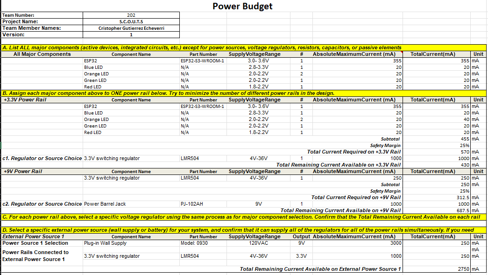

## Overview

The following figure presents the power budget used to estimate subsystem current consumption and validate power supply selection.

{style width:"350" height:"300;"}
**Figure 01:** Wireless Communication Power Budget

## Conclusions
The total worst-case current required on the 3.3 V rail is 570 mA, including a 25% safety margin. The selected LMR50410 switching regulator, rated for 1 A output, provides sufficient capacity with approximately 430 mA of additional headroom.

The regulator draws approximately 250 mA from the 9 V input supply. The selected 9 V, 3 A wall adapter can easily support this requirement, leaving approximately 2750 mA of available current.

Overall, the external power supply and voltage regulator are properly sized and can reliably power all system components simultaneously with adequate safety margin.

## Resources 

The power budget as Microsoft Excel Sheet [*here*](Power%20Budget_314_CGE.xlsx).
