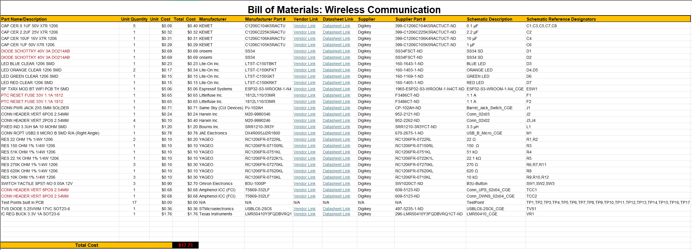

## Overview

The following bill of materials was genererated in Kicad and further modified with additional information such unit cost, manufacturer information and vendor information along with datasheets and links to the parts.

## Bill of Materials
{style width: "2000"}
**Figure 01:** Bill of Materials as a screenshot.

## Resouce

The Bill of Material as a PDF download is available [*here*](BOMv1.pdf).
