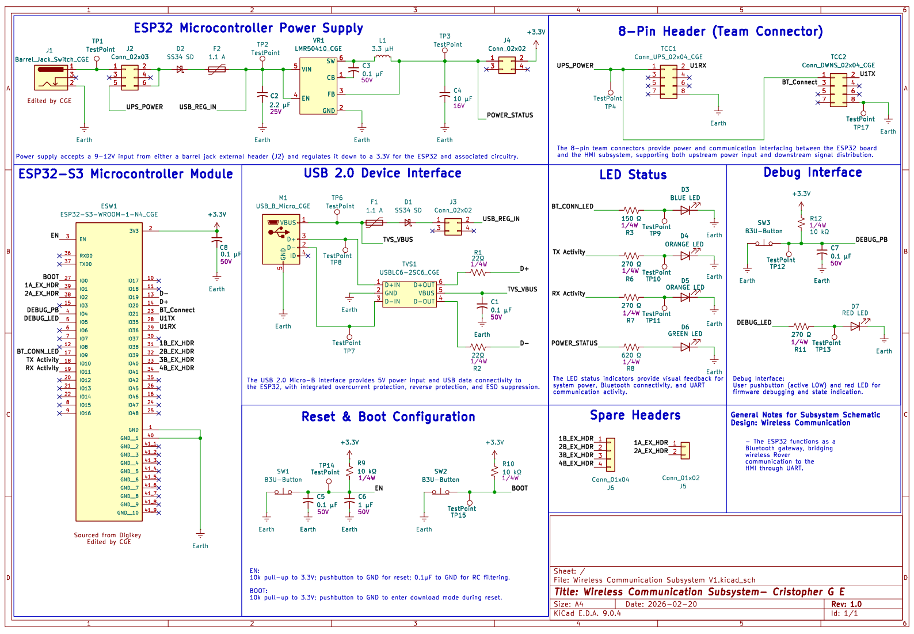

## Overview

The Wireless Communication Subsystem functions as a communication gateway between the rover and the Human-Machine Interface (HMI). It is built around the ESP32-S3-WROOM-1 module, which establishes a WiFi-based MQTT connection through a centralized broker, enabling bidirectional wireless data exchange between the controller and the rover.

All control commands originating from the HMI are transmitted via UART to the local ESP32-S3-WROOM-1, which forwards the data over MQTT to the rover subsystems. Sensor data collected on the rover is transmitted back through the MQTT broker to this subsystem and relayed to the HMI through the UART interface. The subsystem performs no processing or decision-making logic; it operates strictly as a reliable communication bridge.

The board can be powered from either a 9–12V barrel jack input or an upstream power connection from the HMI, with USB 5V available primarily for programming and development. LED indicators provide visual feedback for system power, UART activity, and MQTT connection status, and a dedicated GPIO signal communicates connection status to the HMI.

This architecture maintains clear separation between control, sensing, and user interface layers while providing a stable and efficient wireless communication pathway between the rover and HMI systems.

{style width:"350" height:"300;"}
**Figure 01:** Wireless Communication Subsystem Schematic

## Resouces

The schematic as a PDF download is available [*here*](WCS_SCHEMATIC_FINAL.pdf), and the Zip folder of the project [*here*](Gerber_CGE_V8F.zip).
