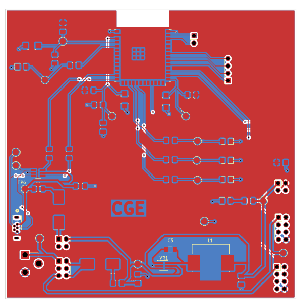
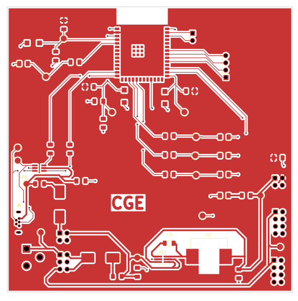
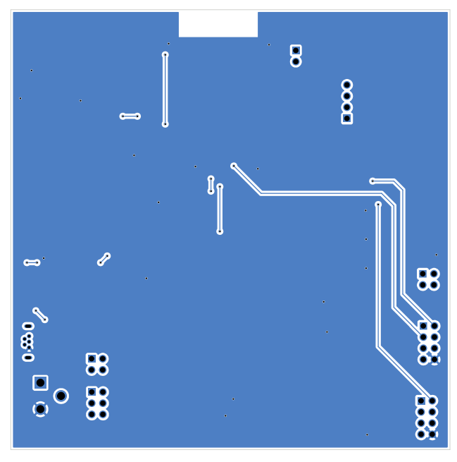
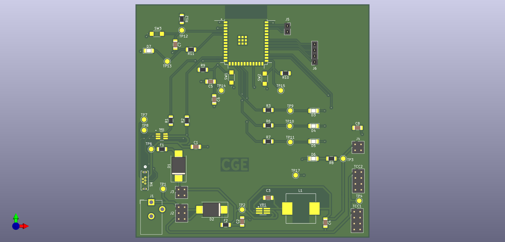
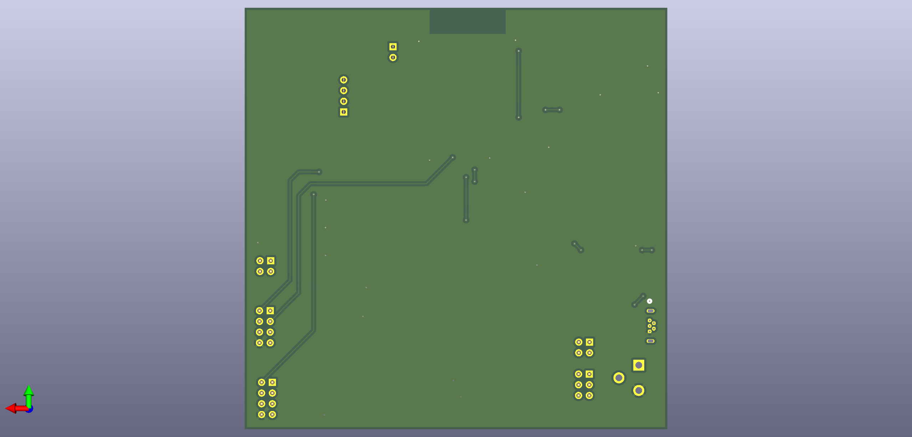

## PCB 

{style width:"350" height:"300;"}
**Figure 01:** Front and Back PCB Layer

{style width:"350" height:"300;"}
**Figure 02:** Front PCB Layer

{style width:"350" height:"300;"}
**Figure 03:** Back PCB Layer

{style width:"350" height:"300;"}
**Figure 04:** Front PCB View

{style width:"350" height:"300;"}
**Figure 04:** Back PCB View

PCB as a PDF download is available [*here*](PCB_PDFV.pdf), and the Zip folder of the project [*here*]().
